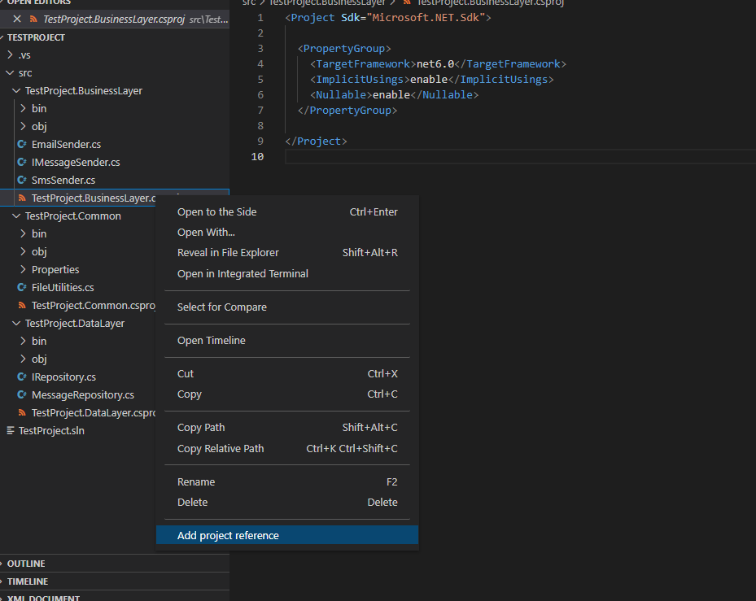

# C# Shortcuts
A VS Code extension that adds shortcuts for common operations for C# projects.

## Features

- _Add project references_: adds an item to the contextual menu for csproj files to visually add or remove references to other projects

- _Manage NuGet packages_: adds an item to the contextual menu for csproj files to manage the installed NuGet packages or to search and install new ones
- _Add existing projects to a solution_: adds an item for sln files to add or remove existing projects to a solution

## Extension Settings

This extension contributes the following settings:

- `csharp-shortcuts.searchPrereleasePackages`: enables searching for prerelease packages in the NuGet package manager

## Known Issues

- Not showing error messages when a file is not found.

## Current Limitations

- Can only search public packages from NuGet.org.

## Release Notes

### 0.0.4

- Added option to manage package references
- Added option to add existing projects to a solution

### 0.0.1

- Initial preview release

## Contribute

Open a PR or an issue on GitHub.